<h2>Tensorflow-Image-Segmentation-Retinal-Vessel (2024/10/31)</h2>

This is the second experiment of Image Segmentation for Retinal Vessel
 based on 
the latest <a href="https://github.com/sarah-antillia/Tensorflow-Image-Segmentation-API">Tensorflow-Image-Segmentation-API</a>, and
<a href="https://drive.google.com/file/d/1wr7sH7w1WymOFYtITd-NZkPUtVGbMxVb/view?usp=sharing">
Retinal-Vessel-ImageMask-Dataset.zip</a>, which was derived by us from  
<a href="https://researchdata.kingston.ac.uk/96/"><b>CHASE_DB1</b> retinal vessel reference dataset</a>

 
 
On our dataset, please refer to the first experiment 
Image-Segmentation-Retinal-Vessel</a>
 
 

<b>Actual Image Segmentation for Images of 512x512 pixels</b> 
As shown below, the inferred masks look similar to the ground truth masks.  

<table>
<tr>
<th>Input: image</th>
<th>Mask (ground_truth)</th>
<th>Prediction: inferred_mask</th>
</tr>
<tr>
<td>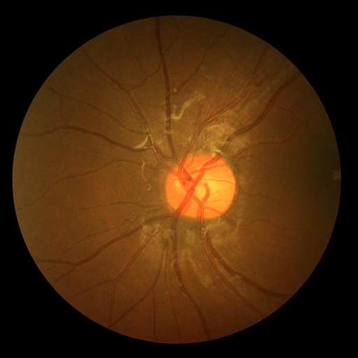</td>
<td>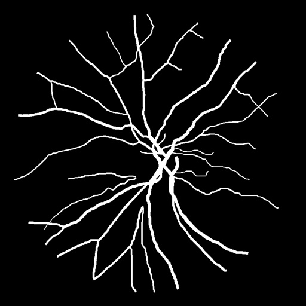</td>
<td>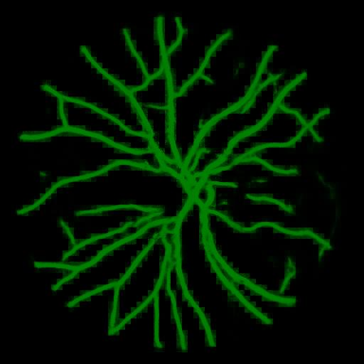</td>
</tr>

<tr>
<td>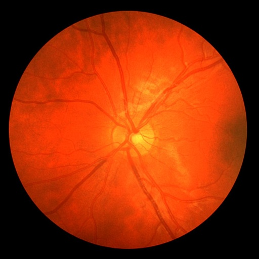</td>
<td>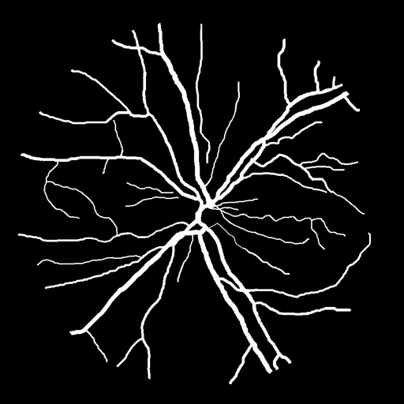</td>
<td>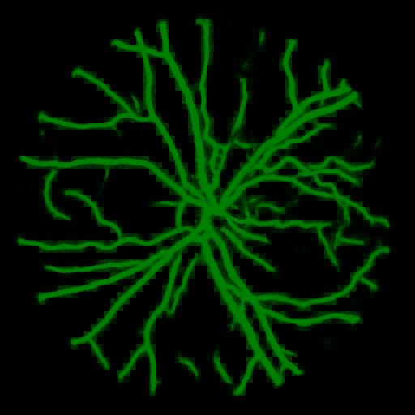</td>
</tr>

<tr>
<td>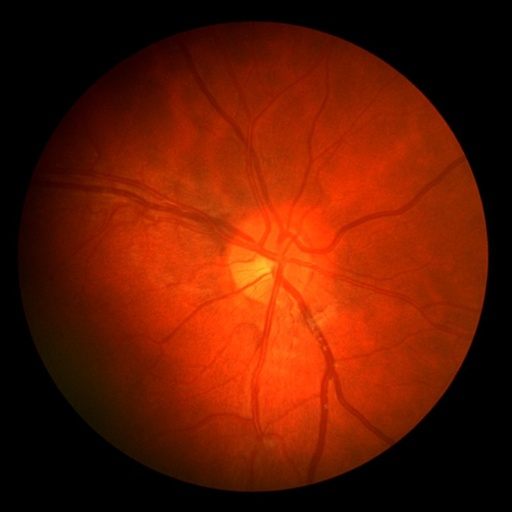</td>
<td>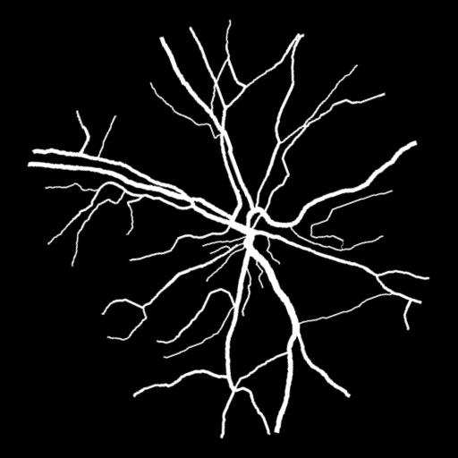</td>
<td>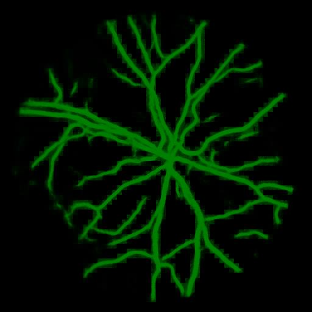</td>
</tr>

</table>

 
In this experiment, we used the simple UNet Model 
<a href="./src/TensorflowUNet.py">TensorflowSlightlyFlexibleUNet</a> for this Retinal-Vessel Segmentation Model. 
As shown in <a href="https://github.com/sarah-antillia/Tensorflow-Image-Segmentation-API">Tensorflow-Image-Segmentation-API</a>.
you may try other Tensorflow UNet Models: 

<li><a href="./src/TensorflowSwinUNet.py">TensorflowSwinUNet.py</a></li>
<li><a href="./src/TensorflowMultiResUNet.py">TensorflowMultiResUNet.py</a></li>
<li><a href="./src/TensorflowAttentionUNet.py">TensorflowAttentionUNet.py</a></li>
<li><a href="./src/TensorflowEfficientUNet.py">TensorflowEfficientUNet.py</a></li>
<li><a href="./src/TensorflowUNet3Plus.py">TensorflowUNet3Plus.py</a></li>
<li><a href="./src/TensorflowDeepLabV3Plus.py">TensorflowDeepLabV3Plus.py</a></li>

 

<h3>1. Dataset Citation</h3>
 The dataset used here has been taken from the following web site of Kingston University Research  
<a href="https://researchdata.kingston.ac.uk/96/">CHASE_DB1 retinal vessel reference dataset</a>
 

Fraz, Muhammad Moazam [Creator], Remagnino, Paolo, Hoppe, Andreas, Uyyanonvara, Bunyarit, Rudnicka,  
Alicja R [Creator], Owen, Christopher G [Creator] and Barman, Sarah A [Creator] (2012) 
 CHASE_DB1 retinal vessel reference dataset. [Data Collection] 
 
Official URL: https://doi.org/10.1109/TBME.2012.2205687
  
<b>Lay Summary</b> 

A public retinal vessel reference dataset CHASE_DB1 made available by Kingston University, London in collaboration with St. George’s, University of London. This is a subset of retinal images of multi-ethnic children from the Child Heart and Health Study in England (CHASE) dataset. This subset contains 28 retinal images captured from both eyes from 14 of the children recruited in the study. In this subset each retinal image is also accompanied by two ground truth images. This is provided in the form of two manual vessel segmentations made by two independent human observers for each of the images, in which each pixel is assigned a "1" label if it is part of a blood vessel and a "0" label otherwise. Making this subset publicly available allows for the scientific community to train and test computer vision algorithms (specifically vessel segmentation methodologies). Most importantly this subset allows for performance comparisons - several algorithms being evaluated on the same database allows for direct comparisons of their performances to be made.

 

<h3>
<a id="2">
2 Retinal-Vessel ImageMask Dataset
</a>
</h3>
 If you would like to train this Retinal-VesselSegmentation model by yourself,
 please download the dataset from the google drive 
<a href="https://drive.google.com/file/d/1wr7sH7w1WymOFYtITd-NZkPUtVGbMxVb/view?usp=sharing">
Retinal-Vessel-ImageMask-Dataset.zip</a>
, expand the downloaded ImageMaskDataset and put it under <b>./dataset</b> folder to be
<pre>
./dataset
└─Retinal-Vessel
    ├─test
    │   ├─images
    │   └─masks
    ├─train
    │   ├─images
    │   └─masks
    └─valid
        ├─images
        └─masks
</pre>

<b>Retinal-Vessel Dataset Statistics</b> 
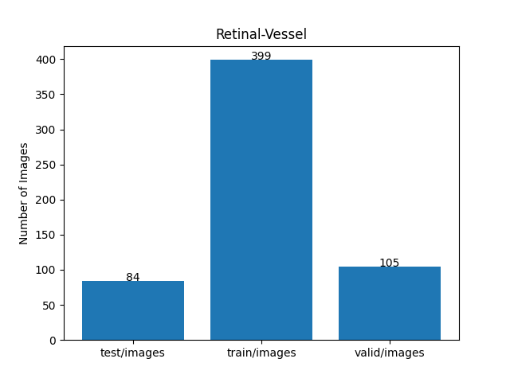 
 
As shown above, the number of images of train and valid datasets is not enough to use for a training set of our segmentation model.
<!-- 
therefore we used an online augmentation tool <a href="./src/ImageMaskAugmentor.py">ImageMaskAugmentor.py</a> 
to improve generalization performance.
-->
 

 
<b>Train_images_sample</b> 
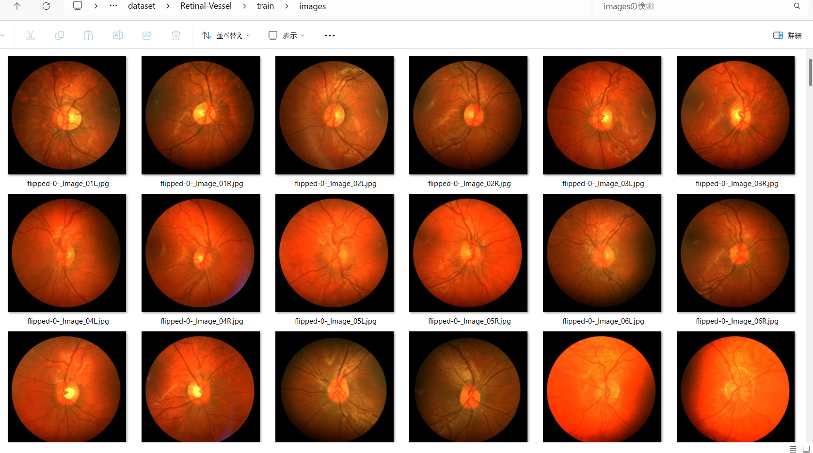
 
<b>Train_masks_sample</b> 
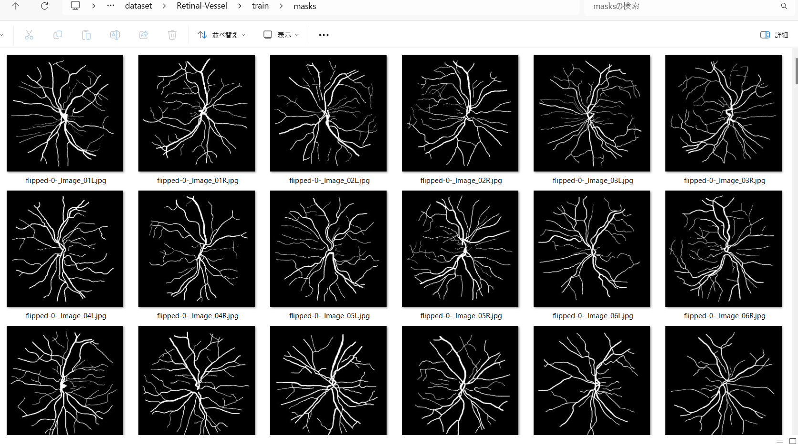
 

<h3>
3 Train TensorflowUNet Model
</h3>
 We have trained Retinal-VesselTensorflowUNet Model by using the following
<a href="./projects/TensorflowSlightlyFlexibleUNet/Retinal-Vessel/train_eval_infer.config"> <b>train_eval_infer.config</b></a> file.  
Please move to ./projects/TensorflowSlightlyFlexibleUNet/Retinal-Vessel and run the following bat file. 
<pre>
>1.train.bat
</pre>
, which simply runs the following command. 
<pre>
>python ../../../src/TensorflowUNetTrainer.py ./train_eval_infer.config
</pre>

<b>Model parameters</b> 
Defined a small <b>base_filters</b> and large <b>base_kernels</b> for the first Conv Layer of Encoder Block of 
<a href="./src/TensorflowUNet.py">TensorflowUNet.py</a> 
and a large num_layers (including a bridge between Encoder and Decoder Blocks).
<pre>
[model]
base_filters   = 16
base_kernels   = (9,9)
num_layers     = 8
</pre>

<b>Learning rate</b> 
Defined a small learning rate.  
<pre>
[model]
learning_rate  = 0.0001
</pre>

<b>Online augmentation</b> 
Disabled our online augmentation.  
<pre>
[model]
model         = "TensorflowUNet"
generator     = False
</pre>

<b>Loss and metrics functions</b> 
Specified "bce_dice_loss" and "dice_coef". 
<pre>
[model]
loss           = "bce_dice_loss"
metrics        = ["dice_coef"]
</pre>
<b>Learning rate reducer callback</b> 
Enabled learing_rate_reducer callback, and a small reducer_patience.
<pre> 
[train]
learning_rate_reducer = True
reducer_factor     = 0.4
reducer_patience   = 4
</pre>

<b>Early stopping callback</b> 
Enabled early stopping callback with patience parameter.
<pre>
[train]
patience      = 10
</pre>

<b>Epoch change inference callbacks</b> 
Enabled epoch_change_infer callback. 
<pre>
[train]
epoch_change_infer       = True
epoch_change_infer_dir   =  "./epoch_change_infer"
epoch_changeinfer        = False
epoch_changeinfer_dir    = "./epoch_changeinfer"
num_infer_images         = 6
</pre>

By using this callback, on every epoch_change, the inference procedure can be called
 for an image in <b>mini_test</b> folder. This will help you confirm how the predicted mask changes 
 at each epoch during your training process.    

<b>Epoch_change_inference output</b> 
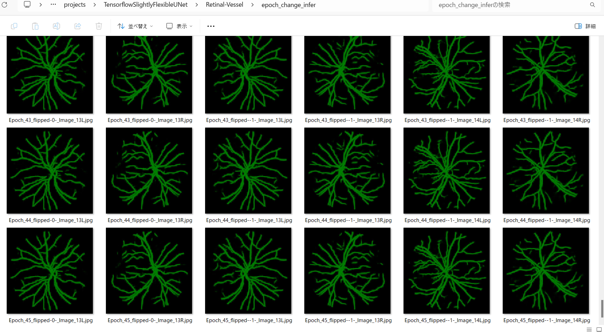 
 
 

In this experiment, the training process was stopped at epoch 45 by EarlyStopping Callback.  
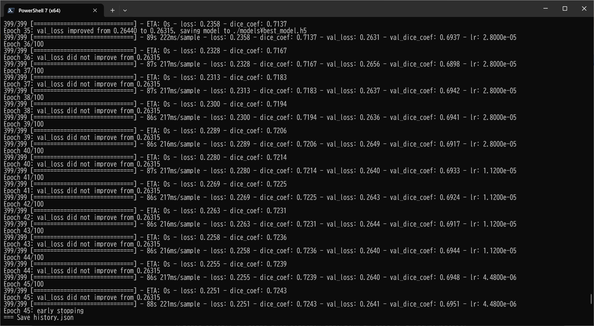 
 

 
<a href="./projects/TensorflowSlightlyFlexibleUNet/Retinal-Vessel/eval/train_metrics.csv">train_metrics.csv</a> 
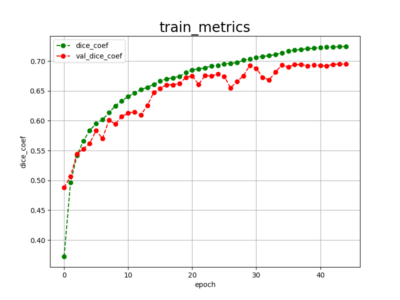 

 
<a href="./projects/TensorflowSlightlyFlexibleUNet/Retinal-Vessel/eval/train_losses.csv">train_losses.csv</a> 
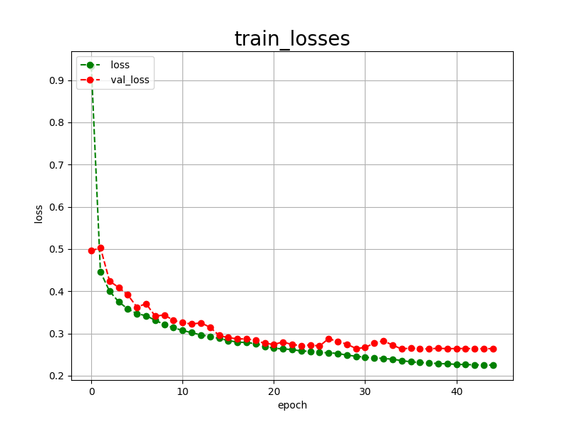 

 

<h3>
4 Evaluation
</h3>
Please move to a <b>./projects/TensorflowSlightlyFlexibleUNet/Retinal-Vessel</b> folder, 
and run the following bat file to evaluate TensorflowUNet model for Retinal-Vessel. 
<pre>
./2.evaluate.bat
</pre>
This bat file simply runs the following command.
<pre>
python ../../../src/TensorflowUNetEvaluator.py ./train_eval_infer_aug.config
</pre>

Evaluation console output: 
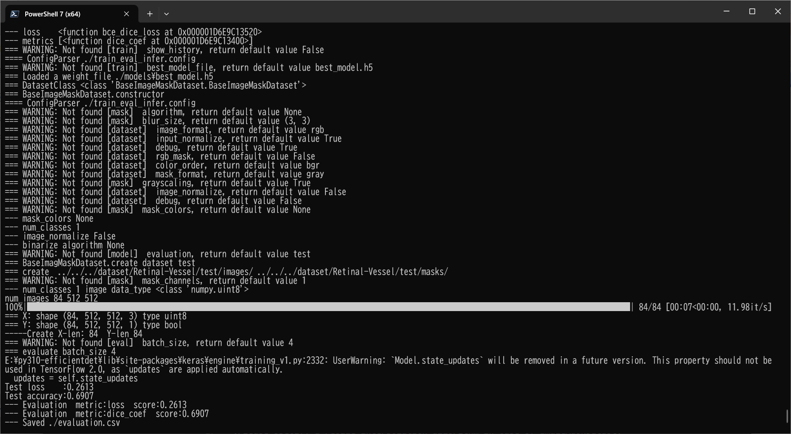
  

<a href="./projects/TensorflowSlightlyFlexibleUNet/Retinal-Vessel/evaluation.csv">evaluation.csv</a> 

The loss (bce_dice_loss) to this Retinal-Vessel/test was not so low, and dice_coef not so high as shown below.
 
<pre>
loss,0.2613
dice_coef,0.6907
</pre>
 TensorFlow Image Segmentation for Liver-Tumor based on Tensorflow-Image-Segmentation-APITensorFlow Image Segmentation for Liver-Tumor based on Tensorflow-Image-Segmentation-API

<h3>
5 Inference
</h3>
Please move to a <b>./projects/TensorflowSlightlyFlexibleUNet/Retinal-Vessel</b> folder 
,and run the following bat file to infer segmentation regions for images by the Trained-TensorflowUNet model for Retinal-Vessel. 
<pre>
./3.infer.bat
</pre>
This simply runs the following command.
<pre>
python ../../../src/TensorflowUNetInferencer.py ./train_eval_infer_aug.config
</pre>

<b>mini_test_images</b> 
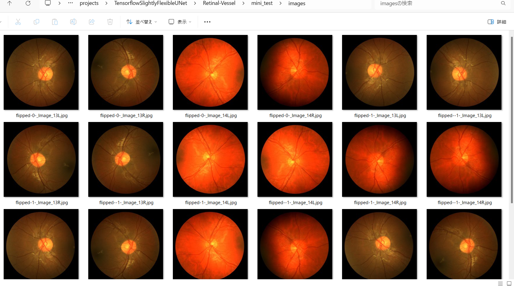 
<b>mini_test_mask(ground_truth)</b> 
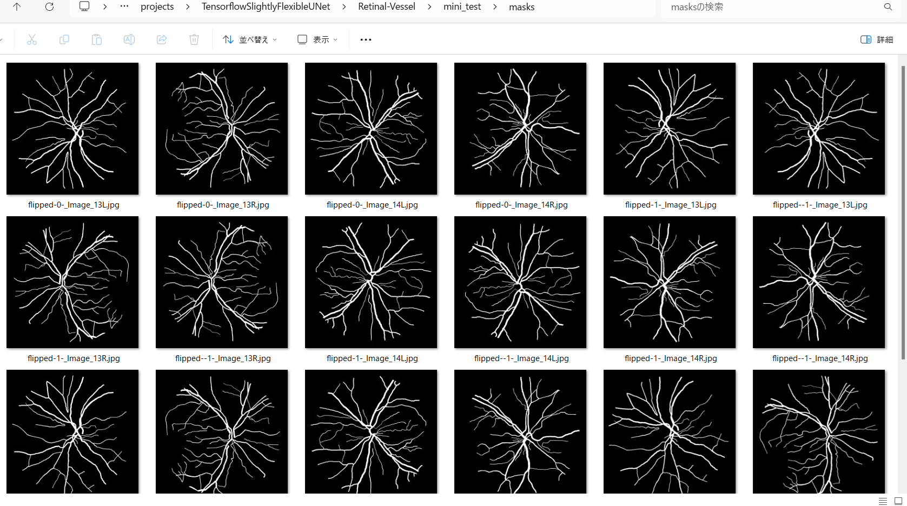 

<b>Inferred test masks</b> 
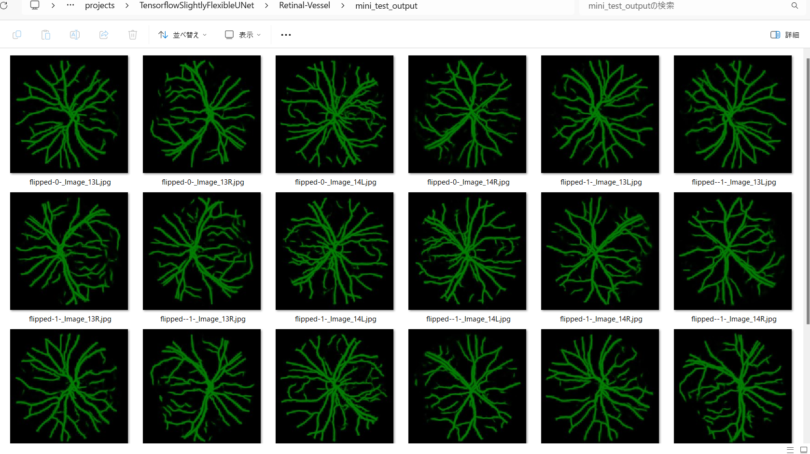 
 

<b>Enlarged images and masks </b> 

<table>
<tr>
<th>Image</th>
<th>Mask (ground_truth)</th>
<th>Inferred-mask</th>
</tr>

<tr>
<td></td>
<td></td>
<td></td>
</tr>

<tr>
<td></td>
<td></td>
<td></td>
</tr>

<tr>
<td>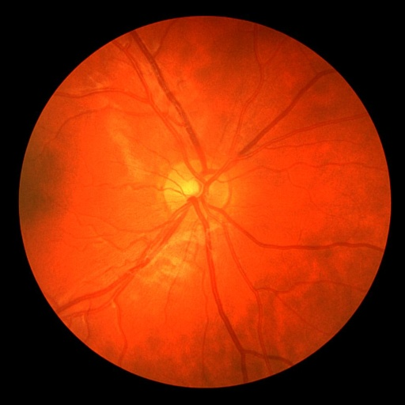</td>
<td>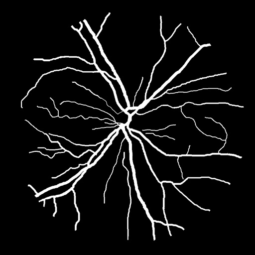</td>
<td>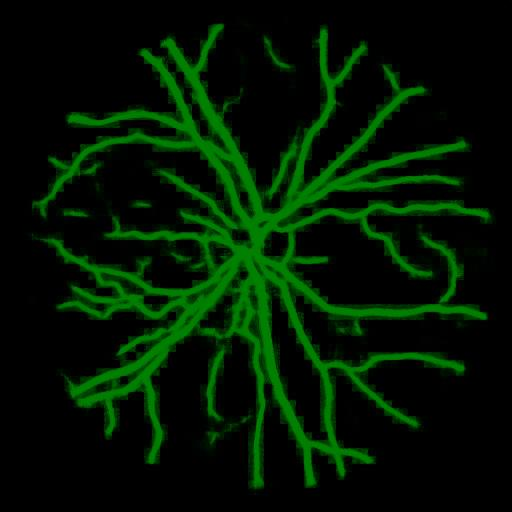</td>
</tr>
<tr>
<td>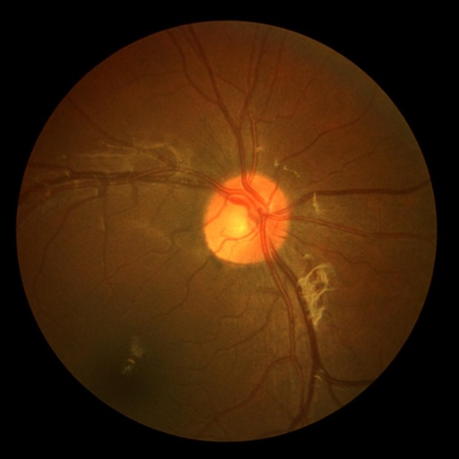</td>
<td>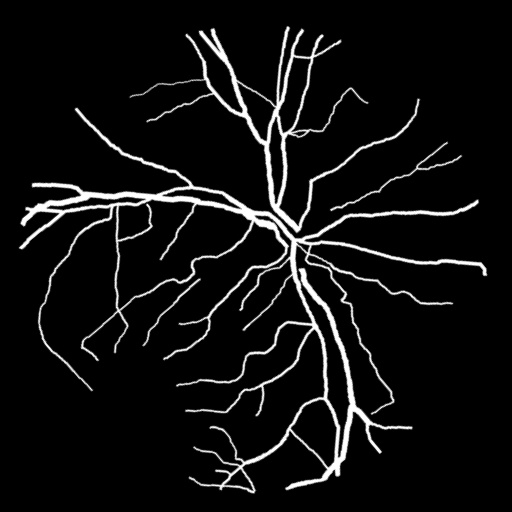</td>
<td>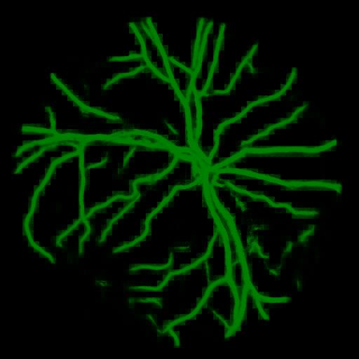</td>
</tr>
<tr>
<td>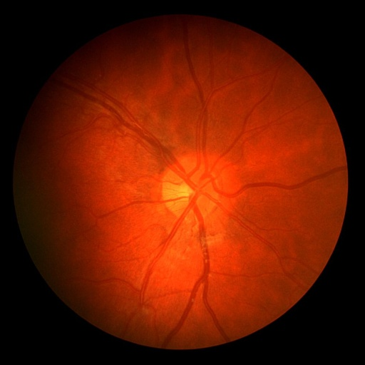</td>
<td>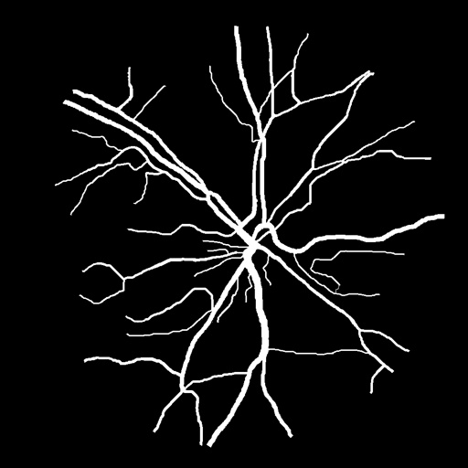</td>
<td>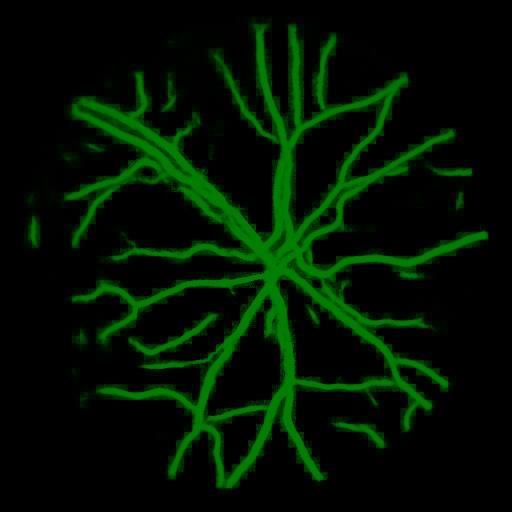</td>
</tr>

</table>

 
<h3>
References
</h3>
<b>1. State-of-the-art retinal vessel segmentation with minimalistic models</b> 
Adrian Galdran, André Anjos, José Dolz, Hadi Chakor, Hervé Lombaert & Ismail Ben Ayed  
<a href="https://www.nature.com/articles/s41598-022-09675-y">
https://www.nature.com/articles/s41598-022-09675-y
</a>
 
<b>2, Image-Segmentation-Retinal-Vessel</b> 
Toshiyuki Arai @antillia.com 
<a href="https://github.com/atlan-antillia/Image-Segmentation-Retinal-Vessel">
https://github.com/atlan-antillia/Image-Segmentation-Retinal-Vessel</a>
 

